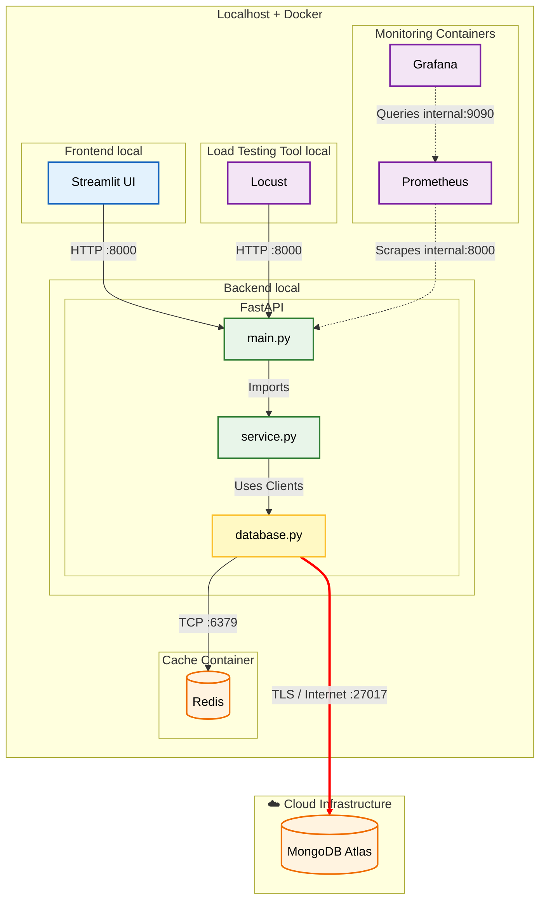

1. INTRODUCTION

This project demonstrates how to integrate Redis as a high-performance caching layer to accelerate data retrieval from a persistent database (MongoDB Atlast). 

By implementing various caching strategies(Cache Aside, Write-Through), and advanced data strunctures(Sorted Sets, Sorted Hashes, Geospatial Indexes), we aim to reduce query latency, lower the load on the primary database, and improve overall system scalability.

2. SYSTEM ARCHITECTURE

 2.1 High Level Application DIAGRAM illustrates the Hybrid Cloud setup:

Initially made by me using www.plantuml.com [1], revized visually by Gemini 3 PRO on 23.01.2026 and converted to mermaid to be easily seen on GitHub.



 2.2 Data Flow: 
    2.2.1 Read (Cache Aside)

 Logic: 
    1. Check Redis Cache (service.py queries REDIS)
    2. Hit: Return Data almost instantly
    3. Miss: We query Mongo, return the data, and the populate Redis Async.

    2.2.2 Write (Write-Through):
 Logic:
    1. Write the data into MongoDb
    2. Populate Redis Async. In this way, Redis won't return outdated data.

3. DATA MODEL

In MongoDb I used the database `sample_mflix' where a movie is stored as a BSON document:

```{"_id":"573a1390f29313caabcd4803","plot":"Cartoon figures announce, via comic strip balloons, that they will move - and move they do, in a wildly exaggerated style.","genres":["Animation","Short","Comedy"],"runtime":7,"cast":["Winsor McCay"],"num_mflix_comments":0,"poster":"https://m.media-amazon.com/images/M/MV5BYzg2NjNhNTctMjUxMi00ZWU4LWI3ZjYtNTI0NTQxNThjZTk2XkEyXkFqcGdeQXVyNzg5OTk2OA@@._V1_SY1000_SX677_AL_.jpg","title":"Esti bine","fullplot":"Cartoonist Winsor McCay agrees to create a large set of drawings that will be photographed and made into a motion picture. The job requires plenty of drawing supplies, and the cartoonist must also overcome some mishaps caused by an assistant. Finally, the work is done, and everyone can see the resulting animated picture.","languages":["English"],"released":"1911-04-08T00:00:00","directors":["Winsor McCay","J. Stuart Blackton"],"writers":["Winsor McCay (comic strip \"Little Nemo in Slumberland\")","Winsor McCay (screenplay)"],"awards":{"wins":1,"nominations":0,"text":"1 win."},"lastupdated":"2015-08-29 01:09:03.030000000","year":1911,"imdb":{"rating":7.7,"votes":1034,"id":1737},"countries":["USA"],"type":"movie","tomatoes":{"viewer":{"rating":3.4,"numReviews":89,"meter":47},"lastUpdated":"2015-08-20T18:51:24"}}```

4. HARDWARE & SOFTWARE:

Host: Apple ARM M1, 16 GB RAM
Virtualization is achieved using Docker Containers
Cloud: MongoDb Atlast running on AWS. 

I used the latest versions of the folowing tools in order to run the Backend&UI on my machine: 

```
fastapi
uvicorn
redis
pymongo
python-dotenv
prometheus-fastapi-instrumentator
requests
streamlit
pandas
plotly
dnspython
```

5. Importand Code Snippets:

Connection to Redis & Mongo(database.py):

```
load_dotenv()

MONGO_URL = os.getenv("MONGO_URL")
REDIS_HOST = os.getenv("REDIS_HOST", "redis") 
REDIS_PORT = int(os.getenv("REDIS_PORT", 6379))


mongo_client = MongoClient(MONGO_URL)

db = mongo_client["sample_mflix"] 


redis_client = redis.Redis(
    host=REDIS_HOST,
    port=REDIS_PORT,
    decode_responses=True 
)
```


REFERENCES:

[1] https://editor.plantuml.com/uml/LO_1JiCm38RlUGhJ-tW4j8q9L6b84zjEqmvMwhKHIHmbBcX2UtVIBb1wIUBV_sz_MIR1ABspwa4wSWJ1el5A1TGVs19KnqGHQYyKBwWfLV2j04vxYOJE6e5ZVGPC-LAtVwbL2DPe5CF-dW3Gx09xyWBL2oPPxMfOPplvfXe6vBeOJouJF8Rh-Lxb_Pz6qo20kissR50GziBnZ-kT6fFW6NL78zPO3uqtzYrlrgCulcU33cJ9IRp2WTaQtrQ_ABl8ZgIZFXMQruWNz7YUnRUC3GWbcQBPkcNT9ncTnneMYuQ__E9f-AXI-SXAD6qdMHefvrg1L1D0xbcwI9bGE2PnCghxujpgGt4loJUzipy0
[2] 


BIBLIOGRAPHIC INFORMATION:

1. Redis Documentation. (n.d.). Data Types & Pipelining. Retrieved from redis.io.
2. MongoDB Documentation. (n.d.). Aggregation Framework. Retrieved from mongodb.com.
3. FastAPI. High performance Python API. Retrieved from fastapi.tiangolo.com.
4. Prometheus & Grafana. (n.d.). Monitoring Stack. Retrieved from prometheus.io.