1. INTRODUCTION

This project demonstrates how to integrate Redis as a high-performance caching layer to accelerate data retrieval from a persistent database (MongoDB Atlast). 

By implementing various caching strategies(Cache Aside, Write-Through), and advanced data strunctures(Sorted Sets, Sorted Hashes, Geospatial Indexes), we aim to reduce query latency, lower the load on the primary database, and improve overall system scalability.

2. SYSTEM ARCHITECTURE

 2.1 High Level Application DIAGRAM illustrates the Hybrid Cloud setup:

Initially made by me using www.plantuml.com [1], revized visually by Gemini 3 PRO on 23.01.2026 and converted to mermaid to be easily seen on GitHub.

```mermaid
---
config:
  theme: mc
---
graph TD

    classDef ui fill:#e3f2fd,stroke:#1565c0,stroke-width:2px,color:#000000;
    classDef app fill:#e8f5e9,stroke:#2e7d32,stroke-width:2px,color:#000000;
    classDef config fill:#fff9c4,stroke:#fbc02d,stroke-width:2px,color:#000000;
    classDef db fill:#fff3e0,stroke:#ef6c00,stroke-width:2px,color:#000000;
    classDef tool fill:#f3e5f5,stroke:#7b1fa2,stroke-width:2px,color:#000000;
    classDef cloud fill:#f5f5f5,stroke:#9e9e9e,stroke-width:2px,stroke-dasharray: 5 5,color:#000000;

    subgraph Cloud_Infrastructure [☁️ Cloud Infrastructure]
        direction TB
        Mongo[(MongoDB Atlas)]:::db
    end


    subgraph Docker_Network [ Localhost + Docker]
        direction TB
        
        subgraph User_Interfaces [Frontend local]
            UI[Streamlit UI]:::ui
        end

        subgraph Application [Backend local]
            subgraph Backend [FastAPI]
                Main[main.py]:::app
                Service[service.py]:::app
                DB_Mod[database.py]:::config
            end
        end

        subgraph Local_Data [Cache Container]
            Redis[(Redis)]:::db
        end

        subgraph Telemetry [Monitoring Containers]
            Prom[Prometheus]:::tool
            Graf[Grafana]:::tool
        end

        subgraph Testing [Load Testing Tool local]
            Locust[Locust]:::tool
        end
    end

    UI -->|HTTP :8000| Main
    Locust -->|HTTP :8000| Main
    
    Main -->|Imports| Service
    Service -->|Uses Clients| DB_Mod
    
    DB_Mod -->|TCP :6379| Redis
    
    Prom -.->|Scrapes internal:8000| Main
    Graf -.->|Queries internal:9090| Prom


    DB_Mod ===>|TLS / Internet :27017| Mongo


    linkStyle 7 stroke:red,stroke-width:3px;
```



## 2.2 Data Flow Strategies

### 🟢 2.2.1 Read (Cache Aside)
*The system lazily loads data into the cache only when requested.*

1.  **🔍 Check Redis Cache:**
    * `service.py` queries Redis for the requested key.
2.  **⚡ Cache Hit:**
    * Data is returned immediately, bypassing the database.
3.  **🐢 Cache Miss:**
    * Query **MongoDB** for the data.
    * Return the data to the client.
    * **Async Action:** Populate Redis with the new data to speed up future requests.

### 🔵 2.2.2 Write (Write-Through)
*The system ensures the cache is updated whenever the database is modified.*

1.  **💾 Write to Database:**
    * Data is first committed to **MongoDB**.
2.  **🔄 Sync Cache:**
    * **Async Action:** Populate or update the corresponding key in **Redis**.
    * *Benefit:* Prevents "stale reads" where the cache might otherwise return outdated information.


3. DATA MODEL

In MongoDb I used the database `sample_mflix' where a movie is stored as a BSON document:


```{"_id":"573a1390f29313caabcd4803","plot":"Cartoon figures announce, via comic strip balloons, that they will move - and move they do, in a wildly exaggerated style.","genres":["Animation","Short","Comedy"],"runtime":7,"cast":["Winsor McCay"],"num_mflix_comments":0,"poster":"..","title":"Esti bine","fullplot":"...","languages":["English"],"released":"1911-04-08T00:00:00","directors":["Winsor McCay","J. Stuart Blackton"],"writers":["Winsor McCay (comic strip \"Little Nemo in Slumberland\")","Winsor McCay (screenplay)"],"awards":{"wins":1,"nominations":0,"text":"1 win."},"lastupdated":"2015-08-29 01:09:03.030000000","year":1911,"imdb":{"rating":7.7,"votes":1034,"id":1737},"countries":["USA"],"type":"movie","tomatoes":{"viewer":{"rating":3.4,"numReviews":89,"meter":47},"lastUpdated":"2015-08-20T18:51:24"}}```


4. HARDWARE & SOFTWARE:

Host: Apple ARM M1, 16 GB RAM

Virtualization is achieved using Docker Containers

Cloud: MongoDb Atlast running on AWS. 

I used the latest versions of the folowing tools in order to run the Backend&UI on my machine: 

```
fastapi
uvicorn
redis
pymongo
python-dotenv
prometheus-fastapi-instrumentator
requests
streamlit
pandas
plotly
dnspython
```

5. Important Code Snippets:

Connection to Redis & Mongo(database.py):

```
load_dotenv()

MONGO_URL = os.getenv("MONGO_URL")
REDIS_HOST = os.getenv("REDIS_HOST", "redis") 
REDIS_PORT = int(os.getenv("REDIS_PORT", 6379))


mongo_client = MongoClient(MONGO_URL)

db = mongo_client["sample_mflix"] 


redis_client = redis.Redis(
    host=REDIS_HOST,
    port=REDIS_PORT,
    decode_responses=True 
)
```

Optimized Getting top N movies using Pipelining and Hashes(service.py):

```
def get_top_movies_optimized(limit=limit_top_movies):
    leaderboard_key = "leaderboard:top_movies_opt"
    ...
    # 3. Luăm detaliile prin Pipeline (Fast Fetch)
    pipe = redis_client.pipeline()
    for mid in top_ids:
        if isinstance(mid, bytes):
            mid = mid.decode('utf-8')
        pipe.hgetall(f"movie:hash:{mid}")
        
    hash_results = pipe.execute()
```

Implemented Cache Invalidation for simulation(main.py):

```
@app.delete("/simulate/invalidate/{movie_id}")
async def force_invalidate(movie_id: str):
    """
    Șterge forțat cheia din Redis.
    Următorul Request va fi obligat să ia datele proaspete din Mongo.
    """
    key = f"movie:{movie_id}"
    hash_key = f"movie:hash:{movie_id}"
    
    redis_client.delete(key)      # Șterge String Cache
    redis_client.delete(hash_key) # Șterge Hash Cache
    
    return {"message": f"Cache invalidated for {movie_id}"}
```

6. PERFORMANCE & INTERPRETATION

I did stress testing using locust.io. For ENDPOINTS /movie/id and /top-movies:

Configuration:

Number of users(Peak): 1
Ramp up: 1
Run time: 120s

NO CACHE(MongoDB) vs CACHE(TTL=200) with Grafana:


The performance increase can be easily seen. Redis improves read speed by 20x+. 

With local Redis(outside Docker). I could get the read speed to around 0.3 MS. An ~150x increase:


Hashes increase performance by only retrieving the needed fields from Redis instead of the whole JSON. This increases read speed by around 10x over Sets(still Redis):


Youtube DEMO: https://youtu.be/1cb9NB1f800

Based on everything I wrote into this file, I generated the presentation RedisDataAcceleration.pdf on 23 JAN 2026 using Gemini 3 PRO[2]. 

The whole code was revised with Copilot[3] for better readbility and code comments.

REFERENCES:

[1] https://editor.plantuml.com/uml/LO_1JiCm38RlUGhJ-tW4j8q9L6b84zjEqmvMwhKHIHmbBcX2UtVIBb1wIUBV_sz_MIR1ABspwa4wSWJ1el5A1TGVs19KnqGHQYyKBwWfLV2j04vxYOJE6e5ZVGPC-LAtVwbL2DPe5CF-dW3Gx09xyWBL2oPPxMfOPplvfXe6vBeOJouJF8Rh-Lxb_Pz6qo20kissR50GziBnZ-kT6fFW6NL78zPO3uqtzYrlrgCulcU33cJ9IRp2WTaQtrQ_ABl8ZgIZFXMQruWNz7YUnRUC3GWbcQBPkcNT9ncTnneMYuQ__E9f-AXI-SXAD6qdMHefvrg1L1D0xbcwI9bGE2PnCghxujpgGt4loJUzipy0

[2] Google, Gemini 3 PRO, https://gemini.google.com/app, Date generated: January 23, 2026.

[3] Copilot, https://copilot.microsoft.com,Date Generate: 15-23 January 2026.

BIBLIOGRAPHIC INFORMATION:

1. Redis Documentation. Data Types & Pipelining. Retrieved from redis.io.
2. MongoDB Documentation. Aggregation Framework. Retrieved from mongodb.com.
3. FastAPI. High performance Python API. Retrieved from fastapi.tiangolo.com.
4. Prometheus & Grafana. Monitoring Stack. Retrieved from prometheus.io.